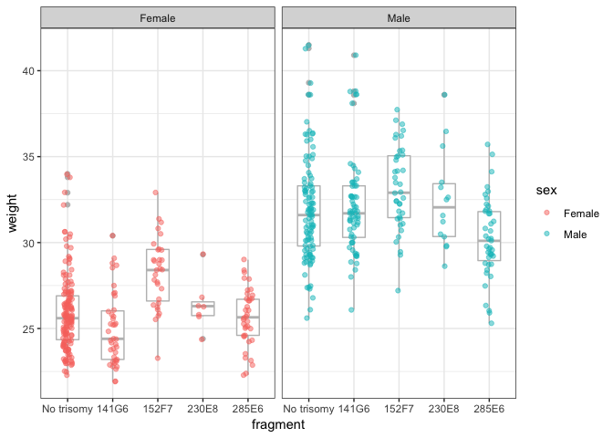

Identifying DNA fragment that increases (Solutions)
================

## Manipulating data tables

We will be using the tidyverse in this lab. So let’s start by loading
it.

``` r
library(tidyverse)
```

    ## ── Attaching packages ─────────── tidyverse 1.2.1 ──

    ## ✔ ggplot2 3.1.0       ✔ purrr   0.3.0  
    ## ✔ tibble  2.0.1       ✔ dplyr   0.8.0.1
    ## ✔ tidyr   0.8.2       ✔ stringr 1.4.0  
    ## ✔ readr   1.3.1       ✔ forcats 0.4.0

    ## ── Conflicts ────────────── tidyverse_conflicts() ──
    ## ✖ dplyr::filter() masks stats::filter()
    ## ✖ dplyr::lag()    masks stats::lag()

Your lab conducted an experiment in which four different fragments of
chromosome 21 were integrated into mice. The four parts are denoted with
*141G6*, *152F7*, *230E8* and *285E6*. The mice were bred resulting in
dozens of transgenic mice. The DNA fragment is not always inherted so
some mice have the extra copy and others don’t. We are interested in
determining if any of these fragments result in an increase in weight, a
characteristic associated with trisomic mice.

The data can be loaded like this.

``` r
load("../rdas/mouse.rda")
```

Which loads the `dat` object into your environment:

``` r
dat
```

    ## # A tibble: 537 x 8
    ##      DNA line         tg   sex   age weight    bp  cage
    ##    <dbl> <chr>     <dbl> <dbl> <dbl>  <dbl> <dbl> <dbl>
    ##  1     3 #50-69-1      1     1   113   31.6  123.     1
    ##  2     3 #50-69-2      1     1   113   31.2  125.     1
    ##  3     3 #50-69-3      1     1   113   28.6  122      1
    ##  4     3 #50-69-4      0     1   113   30.1  126      1
    ##  5     3 #50-69-11     0     1   121   31.3  129.     2
    ##  6     3 #50-69-12     0     1   121   36.4  126.     2
    ##  7     3 #50-69-13     1     1   121   36.5  126.     2
    ##  8     3 #50-69-15     1     1   121   29.8  124.     2
    ##  9     3 #50-69-16     1     1   121   35.6  127      2
    ## 10     3 #50-69-17     1     1   121   33.5  123.     2
    ## # … with 527 more rows

The columns included in this table are the following:

  - *DNA*: Fragment of chromosome 21 integrated in parent mouse
    (1=141G6; 2=152F7; 3=230E8; 4=285E6).
  - *line*: Family line.
  - *tg* - Whether the mouse contains the extra DNA (1) or not (0).
  - *sex*: Sex of mouse (1=male; 0=female).
  - *age*: Age of mouse (in days) at time of weighing.
  - *weight*: Weight of mouse in grams, to the nearest tenth of a gram.
  - *bp*: Blood pressure of the mosue.
  - *cage*: Number of the cage in which the mouse lived

Let’s start by comparing the weights of the no trisomic mice to the
weights of mice with the other four fragmets. Determine which columns
tells us the fragment of the mouse and determine the number of mouse in
each group? Hint: use the *count* function.

``` r
dat %>% count(DNA)
```

    ## # A tibble: 4 x 2
    ##     DNA     n
    ##   <dbl> <int>
    ## 1     1   182
    ## 2     2   158
    ## 3     3    37
    ## 4     4   160

Note that the names are 1, 2, 3, 4. Let’s change these to the actual
names 1=141G6; 2=152F7; 3=230E8; 4=285E6. Create a new column called
`fragment` with the actual fragment names. Hint: Use the `recode`
funtion.

``` r
dat <- mutate(dat, fragment = recode(DNA, 
                                "1"="141G6", 
                                "2"="152F7", 
                                "3"="230E8", 
                                "4"="285E6"))
```

Note that all the mice in our table have one of these names. However, we
know that not all mouse have the fragments. Remember that not all
inhereted the extra copy. Use `filter` and `count` to see how many mice
in the `141G6` group have the extra copy.

``` r
filter(dat, fragment == "141G6") %>% count(tg)
```

    ## # A tibble: 2 x 2
    ##      tg     n
    ##   <dbl> <int>
    ## 1     0    78
    ## 2     1   104

Now change the `fragment` column so that the mice that do not have the
extra copy, have are called `No trisomy`. Hint: use the `ifelse`
function.

``` r
dat <- dat %>% mutate(fragment = ifelse(tg == 0, "No trisomy", fragment)) 
```

Before we continue let’s learn about the `n()` function. Note that we
can perform the same as the `count()` function using `group_by()` and
`n()`

``` r
dat %>% group_by(DNA) %>% summarize(freq = n())
```

    ## # A tibble: 4 x 2
    ##     DNA  freq
    ##   <dbl> <int>
    ## 1     1   182
    ## 2     2   158
    ## 3     3    37
    ## 4     4   160

Now compute the average and standard error in each of the four groups
and the control. Hint: Use `group_by` and `summarize`.

``` r
dat %>% group_by(fragment) %>% 
  summarize(average = mean(weight), se = sd(weight)/sqrt(n()))
```

    ## # A tibble: 5 x 3
    ##   fragment   average    se
    ##   <chr>        <dbl> <dbl>
    ## 1 141G6         29.4 0.423
    ## 2 152F7         31.0 0.401
    ## 3 230E8         30.4 0.833
    ## 4 285E6         28.1 0.342
    ## 5 No trisomy    47.0 8.26

Bonus: Is the above difference statistically signficant at the 0.05
level?

``` r
lm(weight ~ tg, data = dat) %>% summary() %>% .$coef
```

    ##              Estimate Std. Error   t value     Pr(>|t|)
    ## (Intercept)  46.96169   5.757313  8.156875 2.464957e-15
    ## tg          -17.47074   8.030682 -2.175499 3.002977e-02

This is what the dynamite plot would look like:

<!-- -->

Does this make sense? In the next section we demonstrate how data
exploration allows us to detect a problem. We also learn how to make
publication ready plots.

## Data visualization

### Data exploration to identify outliers

A problem with the summary statistics and the barplot above is that it
only shows the average and we learn little about the distribution of the
data. Use the *geom\_boxplot* function to show the five number summary.
Do you see a problem? What is it?

``` r
dat %>% ggplot(aes(fragment, weight)) + geom_boxplot()
```

<!-- -->

We know that a 1000 gram mice does not exist. In fact 100 grams is
already a huge mouse. Use filter to show the data from the mice weighing
more than 100 grams.

``` r
filter(dat, weight > 100) 
```

    ## # A tibble: 5 x 9
    ##     DNA line        tg   sex   age weight    bp  cage fragment  
    ##   <dbl> <chr>    <dbl> <dbl> <dbl>  <dbl> <dbl> <dbl> <chr>     
    ## 1     1 #85-12-1     0     0   101    999   999     1 No trisomy
    ## 2     1 #85-12-2     0     0   101    999   999     1 No trisomy
    ## 3     1 #85-12-3     0     0   101    999   999     1 No trisomy
    ## 4     1 #85-12-4     0     0   101    999   999     1 No trisomy
    ## 5     1 #85-12-5     0     0   101    999   999     1 No trisomy

What are the weights?

``` r
filter(dat, weight > 100) %>% pull(weight)
```

    ## [1] 999 999 999 999 999

An unfortunate common practice is to use the number 999 to denote
missing data. The recommended practice is to acutely type NA. Use the
fitler function remove all the rows with these missing values, then
remake the figure and recompute the averages and standard errors.

``` r
dat <- filter(dat, weight != 999)

dat %>% ggplot(aes(fragment, weight)) + geom_boxplot()
```

<!-- -->

``` r
dat %>% group_by(fragment) %>% 
  summarize(average = mean(weight), se = sd(weight)/sqrt(n()))
```

    ## # A tibble: 5 x 3
    ##   fragment   average    se
    ##   <chr>        <dbl> <dbl>
    ## 1 141G6         29.4 0.423
    ## 2 152F7         31.0 0.401
    ## 3 230E8         30.4 0.833
    ## 4 285E6         28.1 0.342
    ## 5 No trisomy    28.4 0.246

This makes much more sense.

## Data exploration to help answer scientific question

Let us start by creating a boxplot of weight vs fragments:

<!-- From the table above we now see that: -->

<!-- Make a boxplot -->

``` r
dat %>% ggplot(aes(fragment, weight)) + geom_boxplot()
```

<!-- -->

We prefer showing the control data first. To achieve this we need to let
R know that `No trisomy` is the reference. We can do this by converting
the variable into a factor and using the `relevel` function. Like this:

``` r
dat <- mutate(dat, fragment = factor(fragment)) %>% 
       mutate(fragment = relevel(fragment, ref = "No trisomy"))

dat %>% ggplot(aes(fragment, weight)) + geom_boxplot()
```

<!-- -->

Notice that the boxplot do show evidence of asymetry. Use the
`geom_point()` function to add the points to the boxplot.

``` r
dat %>% ggplot(aes(fragment, weight)) + geom_boxplot() + 
  geom_point()
```

<!-- -->

The points are all cluster together and its hard to see them. We can use
`geom_jitter` instead of `geom_point` to fix this:

``` r
dat %>% ggplot(aes(fragment, weight)) + geom_boxplot() + 
  geom_jitter()
```

<!-- -->

What did `geom_jitter` do? Let’s make the spread smaller and add
alpha-blend the data points

``` r
dat %>% ggplot(aes(fragment, weight)) +
  geom_boxplot() + 
  geom_jitter(width = 0.1, alpha = 0.5)
```

<!-- -->

Do you see anything interesting? Note that an unexpected result is
revealed, for some groups it seems like we have a bimodal distribution.
We can use histograms to assess this. For example, here is the histogram
for the control group:

``` r
filter(dat, fragment == "No trisomy") %>%
  ggplot(aes(weight)) +
  geom_histogram()
```

    ## `stat_bin()` using `bins = 30`. Pick better value with `binwidth`.

<!-- -->

To avoid the warning we can add the argument `bindwith = 1` and to make
it nicer looking we can add `color = "black"`.

``` r
filter(dat, fragment == "No trisomy") %>%
  ggplot(aes(weight)) +
  geom_histogram(binwidth = 1, color = "black")
```

<!-- -->

There appears to be evidence for two modes. We can also see this using
the smooth density estimator using `geom_density`:

``` r
filter(dat, fragment == "No trisomy") %>%
  ggplot(aes(weight)) +
  geom_density()
```

<!-- -->

Note that this is similar to the histogram above. Now let’s make it
nice:

``` r
filter(dat, fragment == "No trisomy") %>%
  ggplot(aes(weight)) +
  geom_density(fill = 1, alpha = 0.5) + 
  xlim(c(19,45))
```

<!-- -->

We only looked at the distribution of `weight` in the control group. We
can use ridge plots to compare the distribution across all groups. To
use ridge plots we need to install and load the `ggridges` functions.

``` r
library(ggridges)
```

    ## 
    ## Attaching package: 'ggridges'

    ## The following object is masked from 'package:ggplot2':
    ## 
    ##     scale_discrete_manual

``` r
dat %>% 
  ggplot(aes(weight, fragment)) +
  geom_density_ridges() 
```

    ## Picking joint bandwidth of 1.4

<!-- -->

To avoid the overlap you can use:

``` r
library(ggridges)
dat %>% 
  ggplot(aes(weight, fragment)) +
  geom_density_ridges(scale = 0.9) 
```

    ## Picking joint bandwidth of 1.4

<!-- -->

We see that for most groups we see two modes. What could explain this?

One variable to consider is sex. We can remake the boxplot with points
above but this time use color to distinguish the data from males and
females.

``` r
dat %>% 
  ggplot(aes(fragment, weight, color = sex)) +
  geom_boxplot(width = 0.5, color = "grey") + 
  geom_jitter(width = 0.1, alpha = 0.5)
```

<!-- -->

A problem here is that sex is a number\! It should be a character or a
factor. Change it to a character vector using `mutate` then remake the
plot

``` r
dat <- mutate(dat, sex = ifelse(sex == 1, "Male", "Female"))

dat %>% ggplot(aes(fragment, weight, color = sex)) +
  geom_boxplot(width = 0.5, color = "grey") + 
  geom_jitter(width = 0.1, alpha = 0.5)
```

<!-- -->

Now that we see that males and females have different distributions, the
question arises if the fragment effects are different for males and
females. We can explore this by remaking the plot for each sex
separately. This can be achieved using the the faceting.

``` r
dat %>% ggplot(aes(fragment, weight, color = sex)) +
  geom_boxplot(width = 0.5, color = "grey") + 
  geom_jitter(width = 0.1, alpha = 0.5) + 
  facet_grid(.~sex)
```

<!-- -->

A quick pause to describe themes. `ggplot` provides the options of
changing the general look of plots. There is an entire package,
**ggthemes**, dedicated to providing different themes. Here we use the
black and white theme:

``` r
dat %>% ggplot(aes(fragment, weight, color = sex)) +
  geom_boxplot(width = 0.5, color = "grey") + 
  geom_jitter(width = 0.1, alpha = 0.5) + 
  facet_grid(.~sex) + 
  theme_bw()
```

<!-- -->

This plot is quite informative. First it shows strong evidence that the
152F7 has an effect on weight, especially on females.

### Cage effect?

Are males and females caged together?

``` r
with(dat, table(cage, sex))
```

    ##     sex
    ## cage Female Male
    ##   1       0    4
    ##   2       0    6
    ##   3       0    1
    ##   4       0   10
    ##   5       6    0
    ##   6      10    0
    ##   7       0   10
    ##   8       0    9
    ##   9       0    3
    ##   10      0    2
    ##   11      0    3
    ##   12      0    6
    ##   13      0    5
    ##   14      0    4
    ##   15      0    9
    ##   16      0    8
    ##   17      0    4
    ##   18      0    1
    ##   19      0    5
    ##   20      0    8
    ##   21      0    8
    ##   22      0    9
    ##   23      5    0
    ##   24      1    0
    ##   25      2    0
    ##   26      5    0
    ##   27      3    0
    ##   28      2    0
    ##   29      1    0
    ##   30      4    0
    ##   31      1    0
    ##   32      3    0
    ##   33     10    0
    ##   34      9    0
    ##   35     10    0
    ##   36     10    0
    ##   37     10    0
    ##   38      7    0
    ##   39      0    6
    ##   40      0    9
    ##   41      0    2
    ##   42      0    3
    ##   43      0    1
    ##   44      0    1
    ##   45      0    6
    ##   46      0    1
    ##   47      0   10
    ##   48      0    2
    ##   49      0    3
    ##   50      0    7
    ##   51      0    9
    ##   52      0    6
    ##   53      0    3
    ##   54      0    7
    ##   55     10    0
    ##   56     10    0
    ##   57      5    0
    ##   58      4    0
    ##   59      1    0
    ##   60     10    0
    ##   61      6    0
    ##   62      5    0
    ##   63      5    0
    ##   64     10    0
    ##   65     10    0
    ##   66      6    0
    ##   70      0    8
    ##   71      0   10
    ##   72      0    9
    ##   73      0    8
    ##   74      0    4
    ##   75      0    1
    ##   76      0    3
    ##   77      0    4
    ##   78      0    3
    ##   79     10    0
    ##   80      8    0
    ##   81      4    0
    ##   82      5    0
    ##   83      1    0
    ##   84      1    0
    ##   85      2    0
    ##   86      7    0
    ##   87      2    0
    ##   88     10    0
    ##   89      4    0
    ##   90      0    7
    ##   91      0    7
    ##   92      0    7
    ##   93      0    3
    ##   94      8    0
    ##   95      5    0
    ##   96      9    0
    ##   97      1    0
    ##   98      9    0

Is cage counfounded with fragment? Make boxplots for the females.

``` r
dat %>% 
  filter(sex == "Female") %>%
  mutate(cage = factor(cage)) %>%
  ggplot(aes(cage, weight, color = fragment)) +
  geom_boxplot(width = 0.5, color = "grey") + 
  geom_jitter(width = 0.1, alpha = 0.5) + 
  theme_bw()
```

<!-- -->

When order by meaningful values.

``` r
dat %>% 
  filter(sex == "Female") %>%
  mutate(cage = factor(cage)) %>%
  mutate(cage = reorder(cage, weight, median)) %>%
  ggplot(aes(cage, weight, color = fragment)) +
  geom_boxplot(width = 0.5, color = "grey") + 
  geom_jitter(width = 0.1, alpha = 0.5) + 
  theme_bw()
```

<!-- -->

Take a closer look. Compare just controls and 152F7. Are trisomic mice
higher within each cage? Is what we are seeing really a cage effect?

``` r
dat %>% 
  filter(sex == "Female" & fragment %in% c("No trisomy", "152F7")) %>%
  mutate(cage = factor(cage)) %>%
  mutate(cage = reorder(cage, weight, median)) %>%
  ggplot(aes(cage, weight, color = fragment)) +
  geom_boxplot(aes(color = fragment), width = 0.5) + 
  geom_jitter(width = 0.1, alpha = 0.5) + 
  theme_bw()
```

<!-- -->

### Confounding

For the female mice compute the correlation between blood pressure and
weight.

``` r
dat %>% filter(sex == "Female") %>%
  summarize(cor(weight, bp))
```

    ## # A tibble: 1 x 1
    ##   `cor(weight, bp)`
    ##               <dbl>
    ## 1           -0.0706

The correlation is negative. Does this make sense? Confirm with a plot
that there are not outliers driving this result.

``` r
dat %>% filter(sex == "Female") %>%
  ggplot(aes(weight, bp)) + 
  geom_point(alpha = 0.5)
```

<!-- -->

The plot does confirm that higher weight mice have, on average slightly
lower blood pressure. But we do see clusters. What could these be? Use
color to decipher what cuases the clustering.

``` r
dat %>% filter(sex == "Female") %>%
  ggplot(aes(weight, bp, color = fragment)) + 
  geom_point(alpha = 0.5)
```

<!-- -->

Now use faceting to plot the scatter plot for each fragment separately.

``` r
dat %>% filter(sex == "Female") %>%
  ggplot(aes(weight, bp)) + 
  geom_point(alpha = 0.5) + 
  facet_wrap(fragment ~ .)
```

<!-- -->

We note that the correlation appears positive in each group. Use
`group_by` and `summarize` to corroborate this.

``` r
dat %>% filter(sex == "Female") %>%
  group_by(fragment) %>%
  summarize(cor = cor(weight, bp))
```

    ## # A tibble: 5 x 2
    ##   fragment     cor
    ##   <fct>      <dbl>
    ## 1 No trisomy 0.536
    ## 2 141G6      0.531
    ## 3 152F7      0.262
    ## 4 230E8      0.748
    ## 5 285E6      0.514

Note: Cases in which the overall correlation is the opposite sign as
when looking strata is referred to as Simpsons Paradox.
